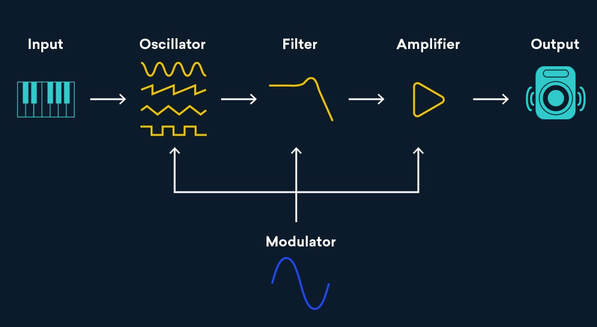

# SYNTH 

Sounds You Need To Hear

## Beginning

Hi, this is a file to log what we do, to know what we've done and where we're going. *(I'd love to make this a LaTeX doc)*

SYNTH is a school project, we are in electronics engineering school, we are three musicians and we wanted to do a synthesizer.
We want to have a keyboard, and be able to generate our sounds, almost from scratch. A teacher agreed with this project,
has already done something similar in the past and will guide us, show us the path, and make it easy for us to learn.

We will not use analog sounds, we'll use a microcontroller (STM32something probably).

*Whiteboard of first look at project, discussion with teacher, what we need to do, how to organize*

The project can be seen in multiple parts :
- read input from keyboard (we already have one, sending MIDI)
- create a waveform,
    - sinus is useless, because no harmonics (we're going with substractive synthesis)
    - squarewave/triangle, or best *sawtooth*, will allow us to have harmonics, so create better sounds with filters but others problems arise
- filter it, modify it, module it
- from digital to analog
- send it to speakers (amp module needed)

Some things to keep in mind for the whole project :
- no latency, not more than 10 ms between key pressed and sound heard
- multiple notes, please, we want something usable
- we need to have 48kHz at any time
- need an interface
- It's a school project, we need to document a lot, it's not a *"I just followed a
tuto step by step by a man in youtube without understanding anything"* project

*What is substractive Synthesis?*

## Create a Waveform (MINBLEP)

Files about this part will be on the Minblep directory, unless something else is specified

In this part we need to create our signal with math, to later be able to modulate it / filter it. 

And we need to do it fast

And we need to do it in real time.

So, let's explore a litle bit before coding it properly on the microcontroller. (we will use Python for that)

<!-- TODO : Finish pyhton code, make screenshots, finish this part, explain why naive approach won't work (with screenshot of fft) and show square, triangle and ssawtooth -->

## Play sounds from STM

<!-- TODO : ask what to put here -->

## Read MIDI input

<!-- TODO : ask what to put here -->
